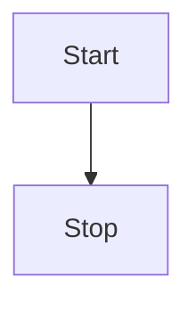
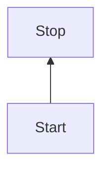
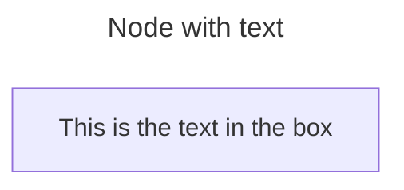
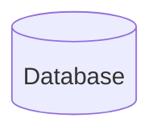
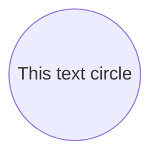
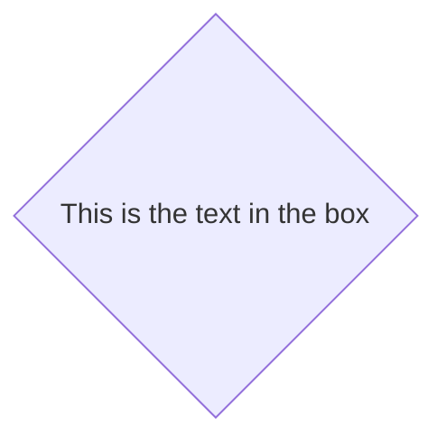
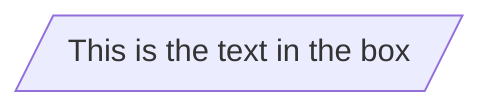
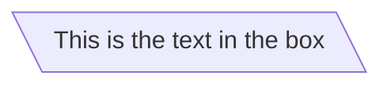
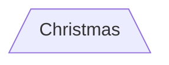
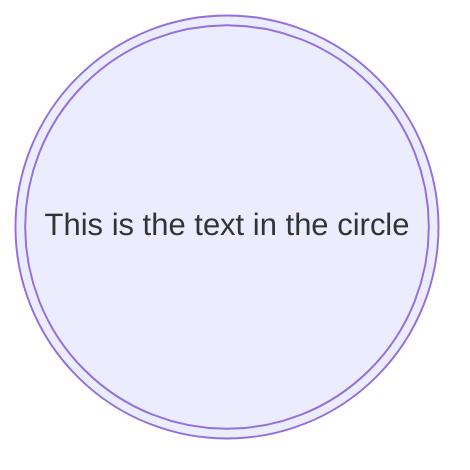

# Como construir Flowcharts

#### Orientação dos dados

* Podemos colocar das seguintes formas:

* TB - top to bottom
* TD - top-down/ same as top to bottom
* BT - bottom to top
* RL - right to left
* LR - left to right

**TOP TO BOTTOM**

```md
flowchart TB
    Start --> Stop
```



**TOP DOWN**

```md
flowchart TD
    Stop --> Start
```


**BOTTOM TOP**

```md
flowchart BT
    Start --> Stop
```



**RIGHT TO LEFT**

```md
flowchart RL
    Start --> Stop
```


**Left to Right**

```md
flowchart LR
    Start --> Stop
```


#### Título 

* Título se coloca como mostra abaixo

```md
---
title: Node with text
---
```



#### Formatos

* Podemos colocar vários formatos, como mostra abaixo

**RETÂNGULO**

```md
flowchart
    id1[This is the text in the box]
```


**RETÂNGULO ARREDONDADO**

```md
flowchart
    id1(This is the text in the box)
```


**CIRCULAR**

```md
flowchart
    id1([This is the text in the box])
```


**SUBROTINA**

```md
flowchart
    id1[[This is the text in the box]]
```


**CILINDRO**

```md
flowchart
    id1[(Database)]
```



**CÍRCULO**

```md
flowchart
    id1((This is the text in the circle))
```



**TIPO BANDEIRINHA**

```md
flowchart
    id1>This is the text in the box]
```


**LOSÂNGO**

```md
flowchart
    id1{This is the text in the box}
```



**HEXAGONO**

```md
flowchart
    id1{{This is the text in the box}}
```


**PARALELOGRAMA**

```md
flowchart
    id1[/This is the text in the box/]
```



**PARALELOGRAMA PARA O OUTRO LADO**

```md
flowchart
    id1[\This is the text in the box\]
```



**TRAPÉZIO**

```md
flowchart
    A[/Christmas\]
```



**TRAPÉZIO DE CABEÇA PARA BAIXO**

```md
flowchart
    B[\Go shopping/]
```


**CIRCULO DUPLO**

```md
flowchart
    id1(((This is the text in the circle)))
```




