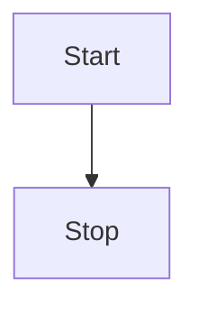
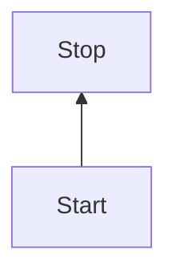
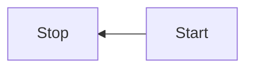

# Como construir Flowcharts

#### Orientação dos dados

* Podemos colocar das seguintes formas:

* TB - top to bottom
* TD - top-down/ same as top to bottom
* BT - bottom to top
* RL - right to left
* LR - left to right

**TOP TO BOTTOM**

```md
flowchart TB
    Start --> Stop
```



**TOP DOWN**

```md
flowchart TD
    Start --> Stop
```


**BOTTOM TOP**

```md
flowchart BT
    Start --> Stop
```



**RIGHT TO LEFT**

```md
flowchart RL
    Start --> Stop
```



****
