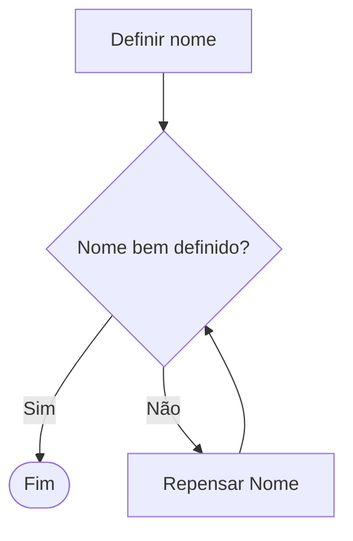
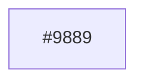

# Constuindo Exemplos de Flowcharts em Mermaid

### Exemplo Simples de Decisão

```md
flowchart TD
    A[Definir nome] --> B{Nome bem definido?}
    B -->|Sim| C([Fim])
    B -->|Não| D[Repensar Nome]
    D --> B
```



### Adicionando Characteres especiais

Nome|Código|Exemplo
|---|---|---|
Raio|`#9889`|

