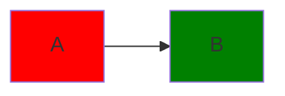
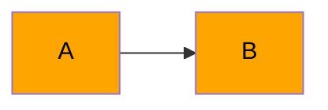

# Colocando cores nos Nodos

## Cor de fundo

podemos colocar cores nos nodos colocando nomes neles utilizando $\color{gold}:::$

```md
flowchart LR
    A:::someclass --> B
```

Dai podemos dentro do mermaid referenciar essa classe usando $\color{gold}classDef$

```md
flowchart LR
    A:::someclass --> B
    classDef someclass
```

Para botar cores precisamos primeiro do código da cor e depois colocar esse código em $\color{gold}fill:código$

```md
flowchart LR
    A:::someclass --> B
    classDef someclass fill:código
```

Aqui uma lista de cores disponíveis:

Nome|Código|
|---|---|
Vermelho|`#ff0000`
Ouro|`#ffd700`
Azul|`#0000FF`
Laranja|`#ffa500`
Roxo|`#800080`
Verde|`#008000`

```md
flowchart LR
    A:::someclass --> B:::otherclass
    classDef someclass fill:#ff0000
    classDef otherclass fill:#008000
```



## Cor da fonte

Podemos trocar a cor da fonte do nodo colocando antes do texto $\color{gold}<font color=nomeCor>$ sendo nomeCor o nome da cor desejada
    
```md
flowchart LR
    A[<font color=black>A]:::someclass --> B[<font color=black>B]:::otherclass
    classDef someclass fill:#ffa500
    classDef otherclass fill:#ffa500
```


    
## Cor nos objetos
    
Podemos colorir qualquer coisa, para deixar bonito
    
  ```md
 flowchart LR
    A[(<font color=white>PostgreSQL)]:::database --> B[\<font color=black>Id\]:::id
    B --> C[<font color=black>Encontrar Veículo]:::drive
    classDef database fill:#0000FF
    classDef id fill:#ffa500
    classDef drive fill:#ffa8d2
 ```
    
 ```mermaid
 flowchart LR
    A[(<font color=white>PostgreSQL)]:::database --> B[\<font color=black>Id\]:::id
    B --> C[<font color=black>Encontrar Veículo]:::drive
    classDef database fill:#0000FF
    classDef id fill:#ffa500
    classDef drive fill:#ffa8d2
 ```
 
 
