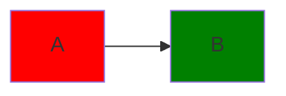

# Colocando cores nos Nodos

podemos colocar cores nos nodos colocando nomes neles utilizando $\color{gold}:::$

```md
flowchart LR
    A:::someclass --> B
```

Dai podemos dentro do mermaid referenciar essa classe usando $\color{gold}classDef$

```md
flowchart LR
    A:::someclass --> B
    classDef someclass
```

Para botar cores precisamos primeiro do código da cor e depois colocar esse código em $\color{gold}fill:código$

```md
flowchart LR
    A:::someclass --> B
    classDef someclass fill:código
```

Aqui uma lista de cores disponíveis:

Nome|Código|
|---|---|
Vermelho|`#ff0000`
Ouro|`#ffd700`
Azul|`#0000FF`
Laranja|`#ffa500`
Roxo|`#800080`
Verde|`#008000`

```md
flowchart LR
    A:::someclass --> B:::otherclass
    classDef someclass fill:#ff0000
    classDef otherclass fill:#008000
```


