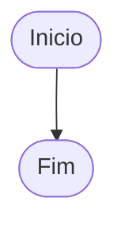
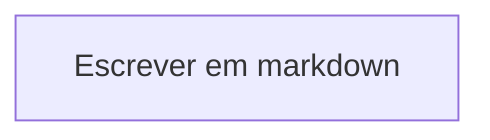
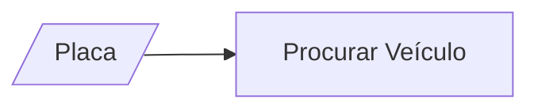
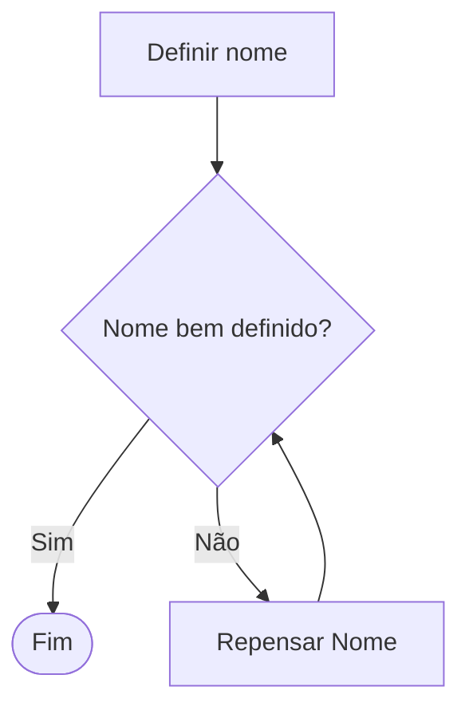

# Entendendo Fluxogramas

## Símbolos

* Cada tipo de objeto tem um significado, com esse significado podemos definir os Fluxogramas de forma correta.

### Terminal / Terminador

Apresenta onde o processo inicia e onde ele termina

### Processo

Representa um processo, uma ação ou uma operação no diagrama, sempre começa com um verbo

### Dados

Dados é uma entrada de informação necessária para um processo, sempre vem antes de um processo

### Decisão

Uma decisão é um escolha entre `Sim` ou `Não` que define o que vai ocorrer, indo para diferentes finalizações

