# Formatos

* Podemos colocar vários formatos, como mostra abaixo

**RETÂNGULO**

```md
flowchart
    id1[This is the text in the box]
```

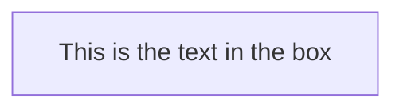

**RETÂNGULO ARREDONDADO**

```md
flowchart
    id1(This is the text in the box)
```

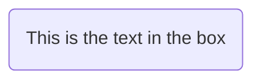

**CIRCULAR**

```md
flowchart
    id1([This is the text in the box])
```

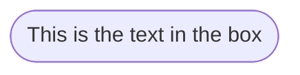

**SUBROTINA**

```md
flowchart
    id1[[This is the text in the box]]
```

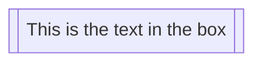

**CILINDRO**

```md
flowchart
    id1[(Database)]
```

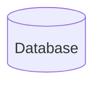

**CÍRCULO**

```md
flowchart
    id1((This is the text in the circle))
```

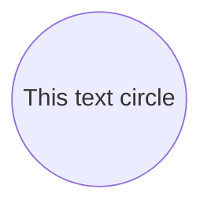

**TIPO BANDEIRINHA**

```md
flowchart
    id1>This is the text in the box]
```

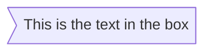

**LOSÂNGO**

```md
flowchart
    id1{This is the text in the box}
```

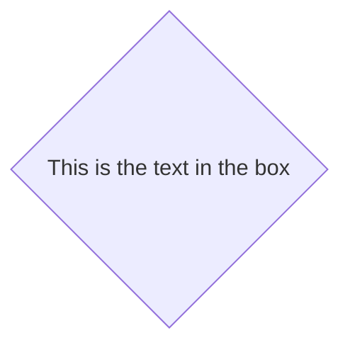

**HEXAGONO**

```md
flowchart
    id1{{This is the text in the box}}
```

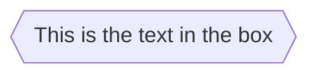

**PARALELOGRAMA**

```md
flowchart
    id1[/This is the text in the box/]
```

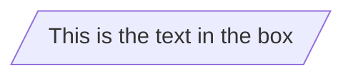

**PARALELOGRAMA PARA O OUTRO LADO**

```md
flowchart
    id1[\This is the text in the box\]
```

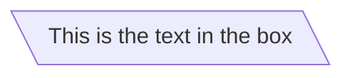

**TRAPÉZIO**

```md
flowchart
    A[/Christmas\]
```

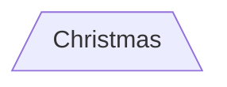

**TRAPÉZIO DE CABEÇA PARA BAIXO**

```md
flowchart
    B[\Go shopping/]
```

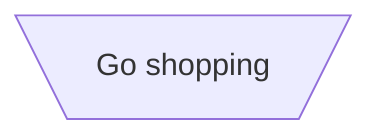

**CIRCULO DUPLO**

```md
flowchart
    id1(((This is the text in the circle)))
```

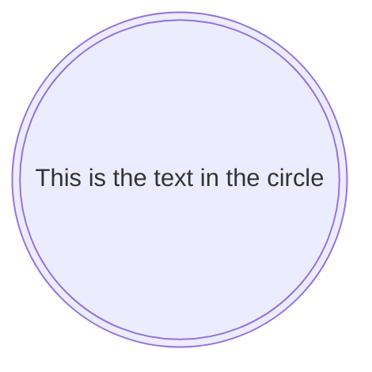