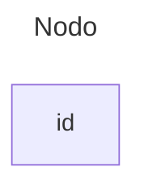

# Links entre Nodos

* Nodos são blocos de informações que podem ser conectados

### **Como fazer Nodos**

```md
---
title: Nodo
---
flowchart
    id
```



### **Conexão de Flecha**

```md
flowchart LR
    A-->B
```


### **Conexão Aberta**

```md
flowchart LR
    A --- B
```


### **Conexão entre pontos**

```md
flowchart LR
   A-.->B;
```


### **Conexão Forte**

```md
flowchart LR
   A ==> B
```


### **Conexão Invisivel**

* Serve somente para poder organizar os nodos

```md
flowchart LR
    A ~~~ B
```


### **Texto dentro da conexão**

```md
---
Conexão Aberta
---

flowchart LR
    A---|This is the text|B
```


```md
---
Conexão Flecha
---

flowchart LR
    A-->|text|B
```


```md
---
Conexão Pontos
---

flowchart LR
   A-. text .-> B
```


```md
---
Conexão Forte
---

flowchart LR
   A == text ==> B
```


