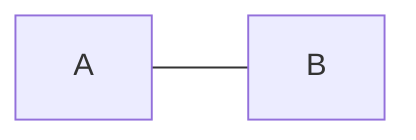
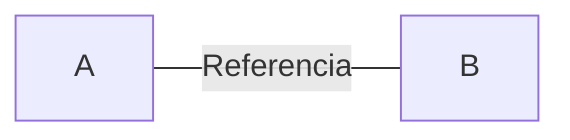

# Links entre Nodos

* Nodos são blocos de informações que podem ser conectados

**Conexão de Flecha**

```md
flowchart LR
    A-->B
```


**Conexão Aberta**

```md
flowchart LR
    A --- B
```



**Texto dentro da conexão**

```md
---
Conexão Aberta
---

flowchart LR
    A-- Referencia ---B
```

