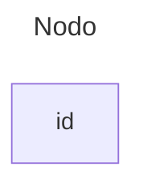
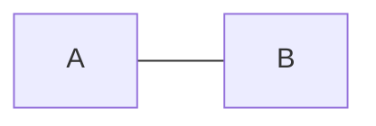
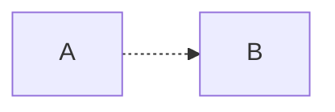
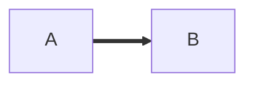
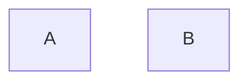
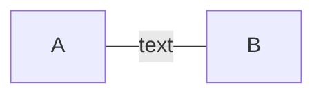
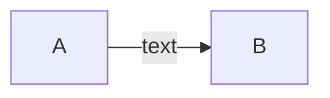
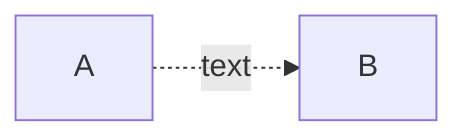
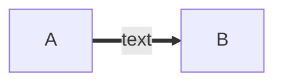
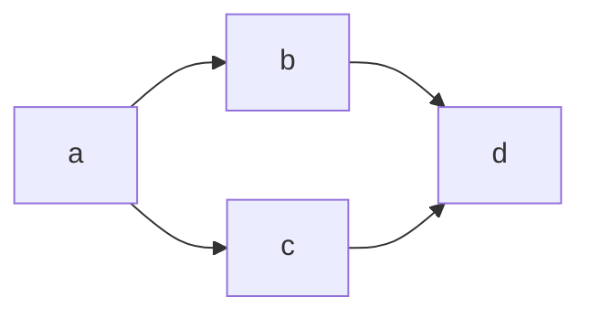

# Links entre Nodos

* Nodos são blocos de informações que podem ser conectados

### **Como fazer Nodos**

```md
---
title: Nodo
---
flowchart
    id
```



### **Conexão de Flecha**

```md
flowchart LR
    A-->B
```


### **Conexão Aberta**

```md
flowchart LR
    A --- B
```



### **Conexão entre pontos**

```md
flowchart LR
   A-.->B;
```



### **Conexão Forte**

```md
flowchart LR
   A ==> B
```



### **Conexão Invisivel**

* Serve somente para poder organizar os nodos

```md
flowchart LR
    A ~~~ B
```




### **Texto dentro da conexão**

```md
---
Conexão Aberta
---

flowchart LR
    A---|text|B
```



```md
---
Conexão Flecha
---

flowchart LR
    A-->|text|B
```



```md
---
Conexão Pontos
---

flowchart LR
   A-. text .-> B
```



```md
---
Conexão Forte
---

flowchart LR
   A == text ==> B
```



### **Conexão de Links**

* Agora podemos conectar como quisermos

##### **Nodo para Nodo constante**

```md
flowchart LR
---
A vai para B e B vai para C
---
   A -- text --> B -- text2 --> C
```

```mermaid
flowchart LR
---
A vai para B e B vai para C
---
   A -- text --> B -- text2 --> C
```

```md
flowchart LR
---
A vai para B e B vai para C
---
   A -- text -- B -- text2 -- C
```

```mermaid
flowchart LR
---
A vai para B e B vai para C
---
   A -- text -- B -- text2 -- C
```

```md
flowchart LR
---
A vai para B e B vai para C
---
   A -. text .-> B -. text2 .-> C
```

```mermaid
flowchart LR
---
A vai para B e B vai para C
---
   A -. text .-> B -. text2 .-> C
```

```md
flowchart LR
---
A vai para B e B vai para C
---
   A == text ==> B == text2 ==> C
```

```mermaid
flowchart LR
---
A vai para B e B vai para C
---
   A == text ==> B == text2 ==> C
```

#### **Multiplos Nodos na mesma linha**

* Podemos colocar conexões tudo na mesma linha de multiplos nodos

```md
---
A vai para B e B vai para D
B vai para C e C vai para D
---
flowchart LR
   a --> b & c--> d
```



