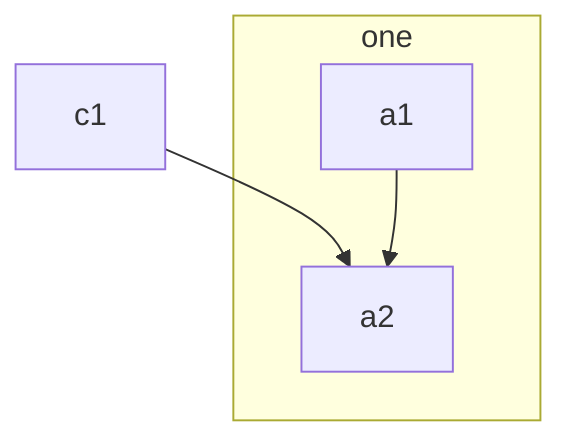
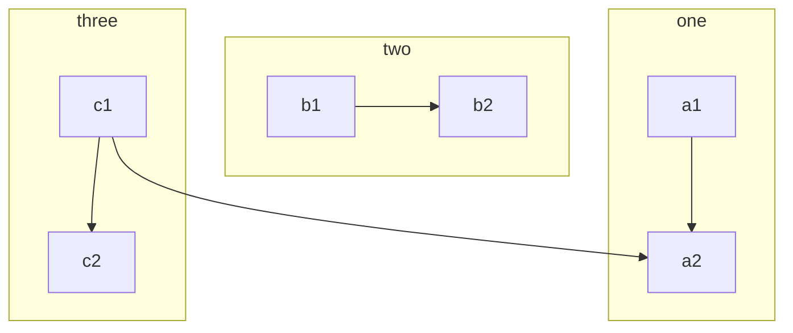
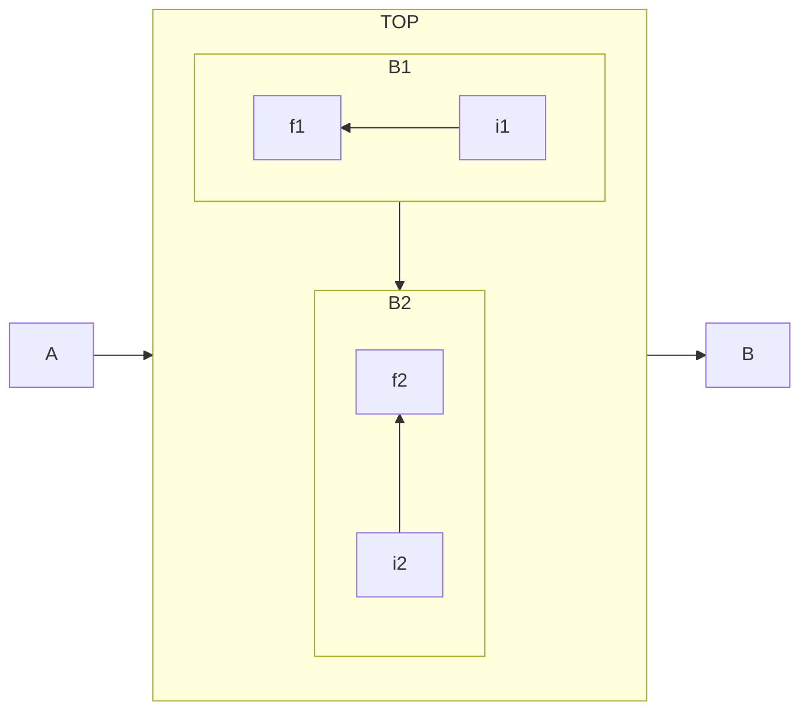

# O que é um Subgrafo

Subgrafo são áreas internas dentro de um diagrama, podemos ter vários subgrafos dentro de um diagrama

#### Um só subgrafo

```md
flowchart TB
    c1-->a2
    subgraph one
    a1-->a2
    end
```



#### Multiplos Subgrafos

```md
flowchart TB
    c1-->a2
    subgraph one
    a1-->a2
    end
    subgraph two
    b1-->b2
    end
    subgraph three
    c1-->c2
    end
```


### Direções de Subgrafos

* Podemos orientar um subgrafo como quisermos, só precisamos usar o $\color{yellow}direction$

```md
flowchart LR
  subgraph TOP
    direction TB
    subgraph B1
        direction RL
        i1 -->f1
    end
    subgraph B2
        direction BT
        i2 -->f2
    end
  end
  A --> TOP --> B
  B1 --> B2
```


